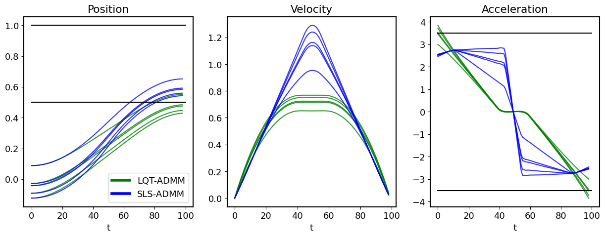
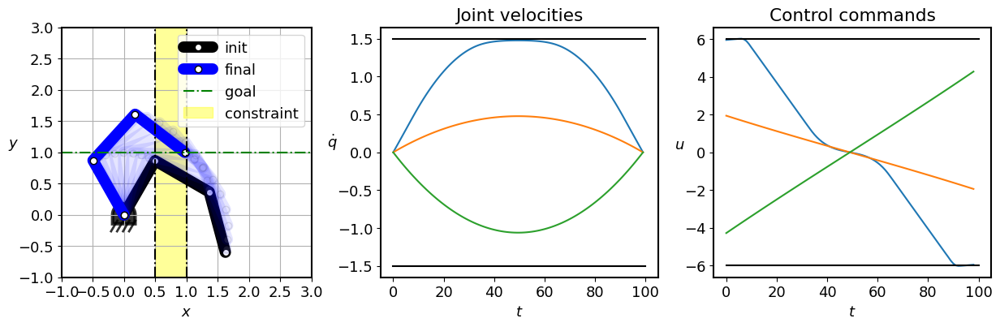

# iLQR-ADMM
Constrained robust optimal control library for robotics.

**Robust (SLS-ADMM) and non-robust (LQT-ADMM) optimal control with state and control constraints
for a double integrator system**
* SLS-ADMM can guarantee robustness to an initial position change within a given variance, 
with a chosen safety probability, while LQT-ADMM only satisfies the constraints along the nominal solution.

**iLQR-ADMM with state and control bounds for a 3DoF planar robot arm.**
* Fast optimization for nonlinear systems

Dependencies:
- numpy
- scipy
- matplotlib
- pinocchio