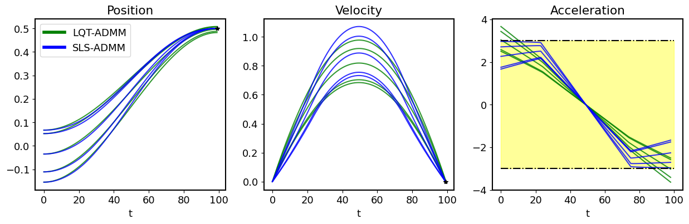

# iLQR-ADMM
Constrained robust optimal control library for robotics.

**Robust (SLS-ADMM) and non-robust (LQT-ADMM) optimal control with state and control constraints
for a double integrator system**
* SLS-ADMM can guarantee robustness to an initial position change within a given variance, 
with a chosen safety probability, while LQT-ADMM only satisfies the constraints along the nominal solution.


**iLQR-ADMM with state and control bounds for a 3DoF planar robot arm.**
* Fast optimization for nonlinear systems


**iLQR with control bounds for a 2D car model.**
* Fast optimization for nonlinear systems
<p float="middle">
  
  
</p>

Guideline:  
```
    isls = iSLS(x_dim, u_dim, N)
    if nonlinear dynamics:
        f(x_{t}, u_{t}): returns x_{t+1} forward dynamics function
        isls.forward_model = f
        get_AB(x,u): returns A,B
    else:
        isls.AB = A,B
    if nonquadratic cost:
        isls.cost_function = cost
        get_Cs()
    else:
        isls.set_cost_variables()
        
    isls.solve_ilqr() 
```


Dependencies:
- numpy
- scipy
- matplotlib
- pinocchio